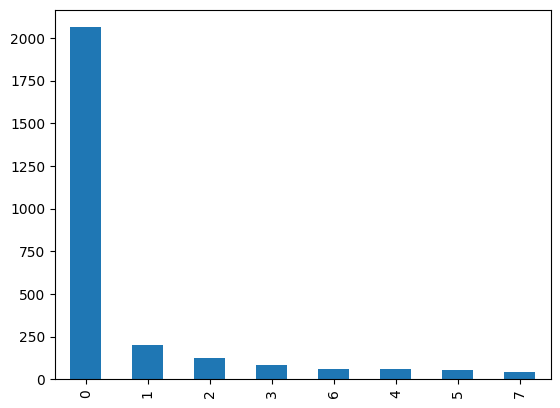
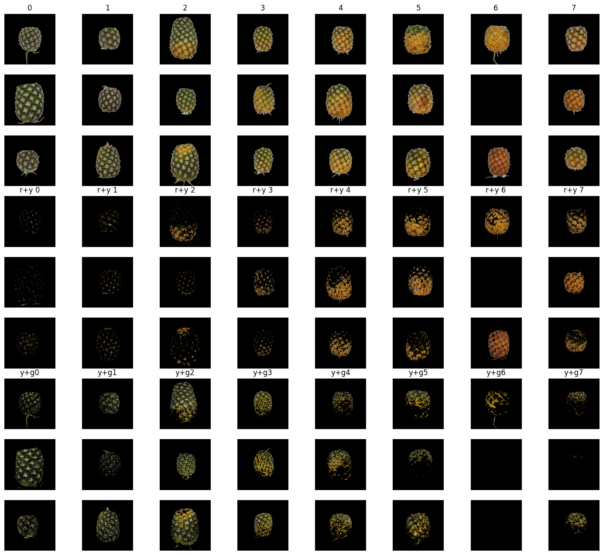
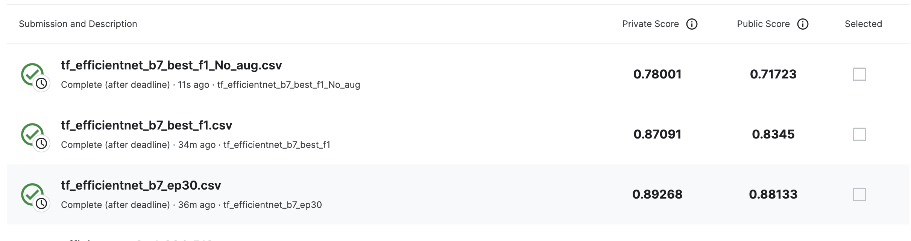

# fruit_ripeness
SuperAI SS3 : Hackaton Image processing (Classification) | Prediction Ripeness of Smooth Cayenne Pineapple

Train - จำนวน 2,688 รูป (8 Classes)

Test - จำนวน 673 รูป

info.csv - ลักษณะสีเปลือกสับปะรดปัตตาเวีย  
0 : สับปะรดที่มีเปลือกตาสีเขียวทั้งหมด 
1 : สับปะรดที่มีเปลือกตาเหลืองไม่เกิน 20% ของผล (ไม่เกิน 2 ตา) 
2 : สับปะรดที่มีเปลือกตาเหลือง อยู่ระหว่าง 20% - 40% ของผล (ไม่เกิน 2 ตา) 
3 : สับปะรดที่มีเปลือกตาเหลือง อยู่ระหว่าง 40% - 55% ของผล (4-6 ตา) 
4 : สับปะรดที่มีเปลือกตาเหลือง ไม่น้อยกว่า 55% แต่ไม่เกิน 90% ของผล (7-9 ตา) 
5 : สับปะรดที่มีเปลือกตาสีเหลืองมากกว่า 90% แต่มีสีส้มน้อยกว่า 20% ของผล 
6 : สับปะรดที่มีเปลือกตาสีส้มแดงประมาณ 20 - 100% 
7 : เปลือกน้ำตาลอมแดง แสดงอาการเน่า (อายุมากกว่า 165 วัน) 

Load Dataset >>> !kaggle competitions download -c fruit-ripening

## Preprocess

## Model - efficientnet_b7

